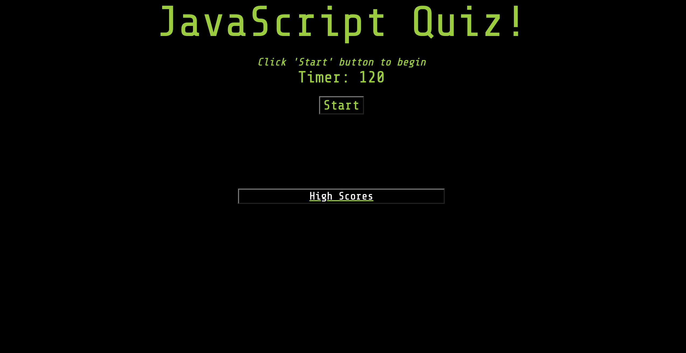
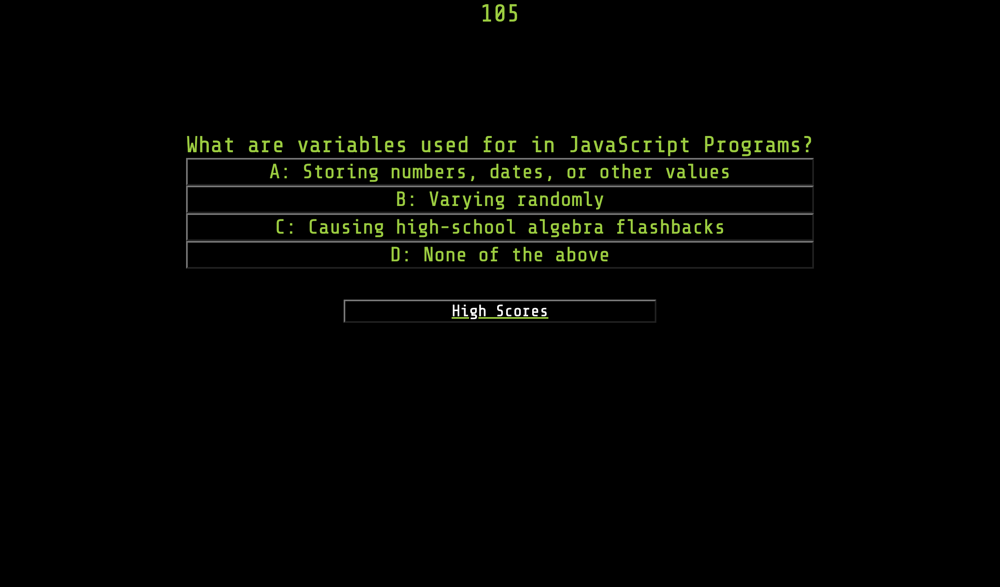
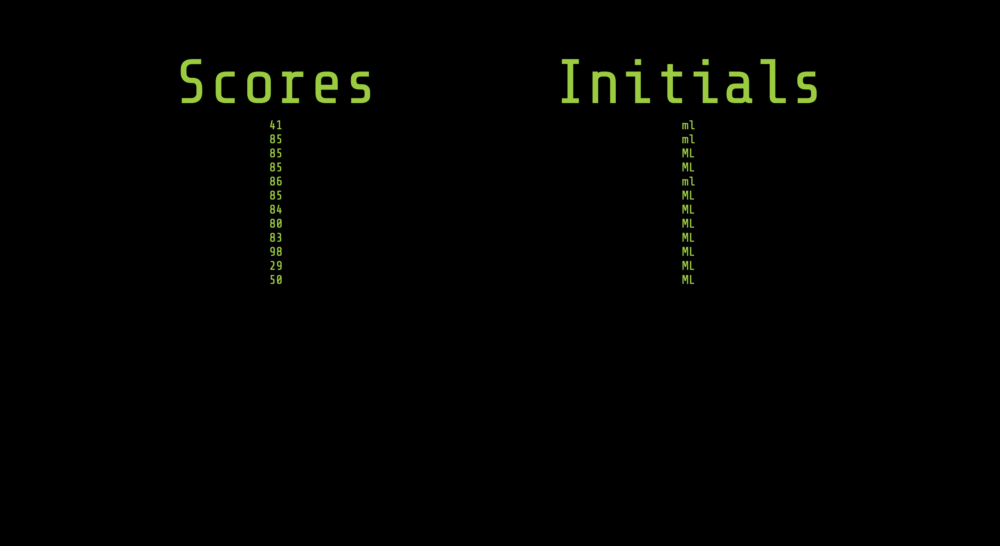

# Js-code-quiz

## Description
This is a timed, multiple choice quiz on the topic of JavaScript. Once completing the quiz, users can enter their initials and then view high scores. High Scores are also viewable at any point by clicking the 'view high score' button. 

## Screenshots

